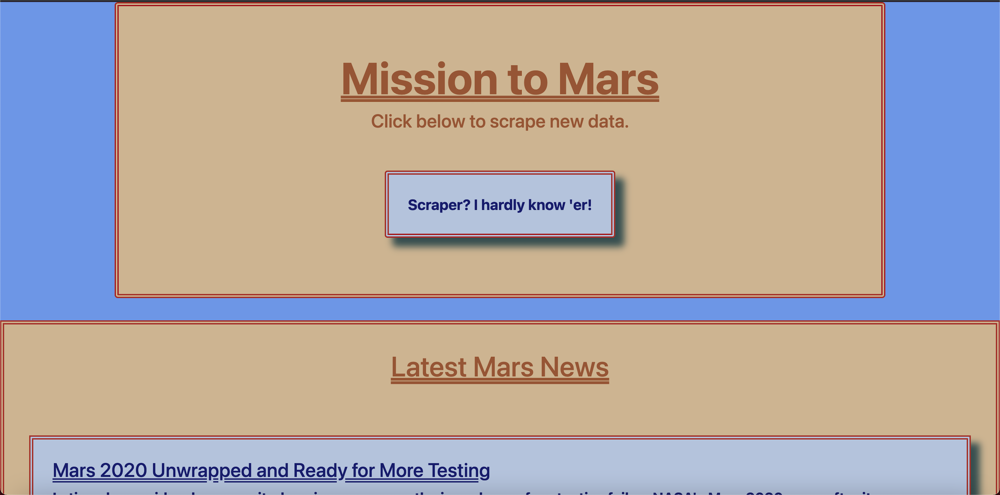
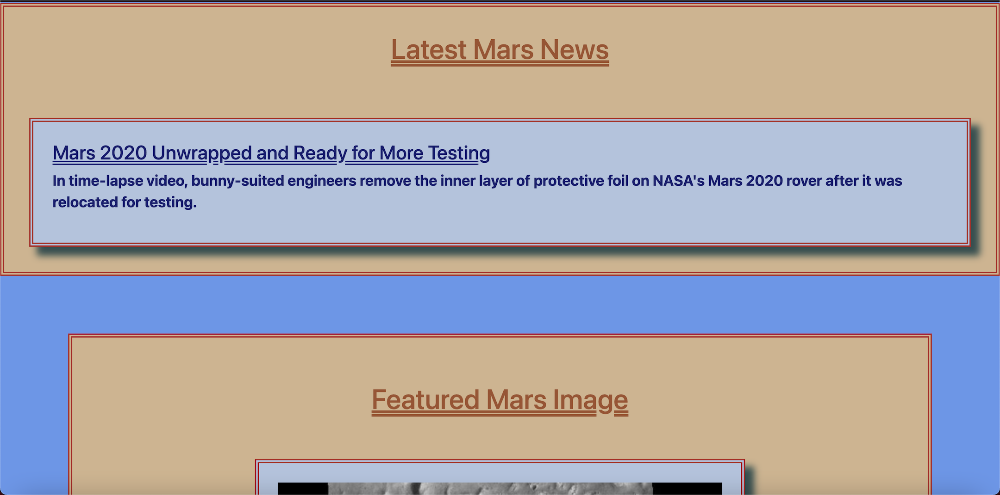
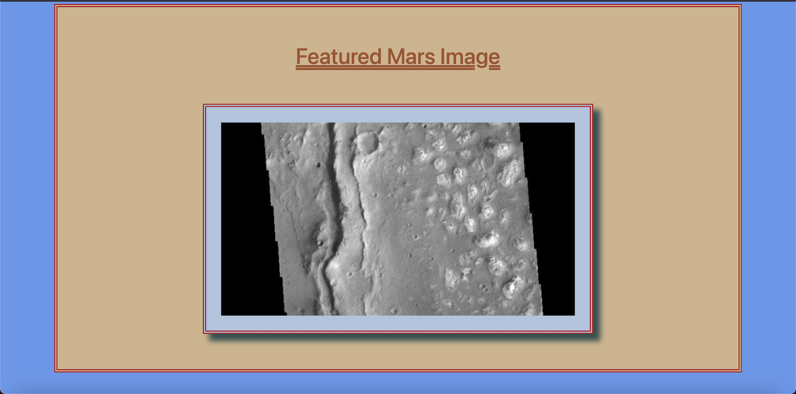
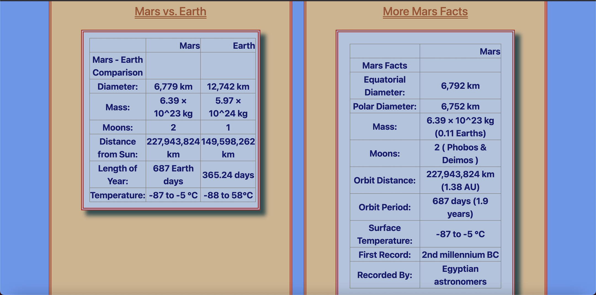
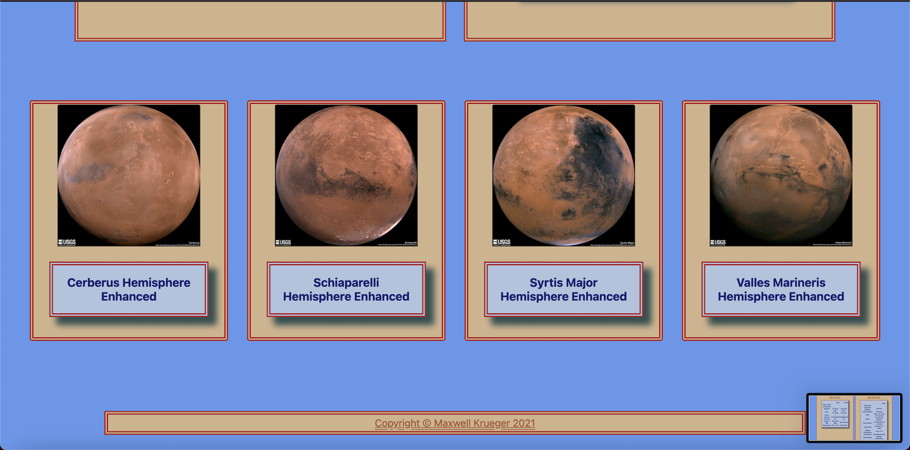

# web-scraping-challenge
Repo for HW on Web Scraping

Well, it wouldn't really be a Max Krueger program if I turned it in on-time, now would it? Anyway, every part of this homework was easy-peasy for me, but the Flask deployment is still messing me up. It took me almost no time to get my index.html working how I wanted it to, and the web scraping was simple. The majority of my time was spent moving around files in my database and tweaking syntax in my app.py file to attempt to get my app to run properly. I got there in the end, and am rather happy with the layout and function of my site.

